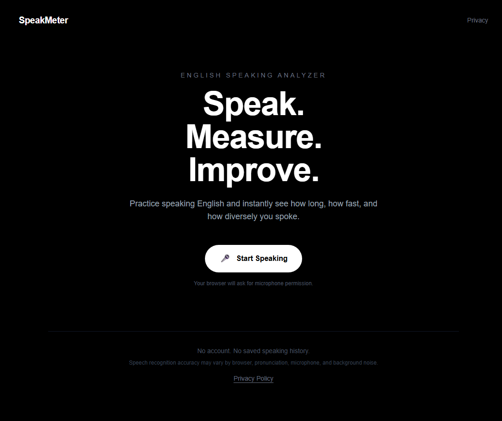
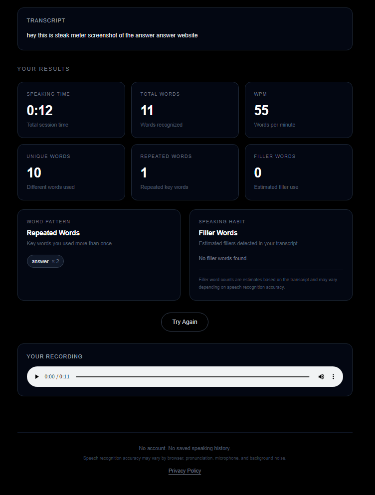

# 🎤 SpeakMeter

**Speak. Measure. Improve.**

SpeakMeter is a simple web tool that helps English learners measure their speaking practice.



Instead of only wondering, *"Did I speak enough?"*, SpeakMeter gives you quick statistics about how much and how you spoke.

## Why I Built This

When I practice speaking English, I often want to know things like:

* How long did I actually speak?
* How many words did I use?
* How fast was I speaking?
* Am I repeating the same words too much?
* How often am I using filler words?

I wanted a small tool that could answer these questions immediately after a speaking session without requiring an account or saving my practice history.

That became **SpeakMeter**.

## Features

SpeakMeter currently analyzes:



* ⏱**Speaking Time** — how long the speaking session lasted
* **Total Words** — total number of recognized words
* **WPM** — estimated words spoken per minute
* **Unique Words** — number of different words used
* **Repeated Words** — frequently repeated words, excluding common stop words
* 💬 **Filler Words** — estimated use of words such as `um`, `uh`, `like`, and `actually`

SpeakMeter also provides:

* Microphone recording
* Live speech-to-text transcription
* ▶Recording playback
* Try Again for a new session

## How It Works

```text
Start Speaking
      ↓
Record your voice
      ↓
Browser speech recognition
      ↓
Generate transcript
      ↓
Analyze transcript
      ↓
View speaking metrics
```

SpeakMeter uses the browser's **Web Speech API** for speech recognition.

The generated transcript is then analyzed with custom TypeScript logic to calculate the speaking metrics.

## Tech Stack

* **Next.js**
* **TypeScript**
* **Tailwind CSS**
* **MediaRecorder API**
* **Web Speech API**
* Custom text analysis logic

## Privacy

SpeakMeter is designed as a temporary, session-based tool.

It does not require:

* User accounts
* Login
* A SpeakMeter database
* Saved speaking history

SpeakMeter does not store recordings, transcripts, or analysis results in its own database.

Speech recognition is provided through the browser's Web Speech API. Depending on the browser and device, audio may be processed by a speech recognition service provided by the browser or operating system provider.

See the **Privacy Policy** inside SpeakMeter for more information.

## Accuracy

Speaking metrics are based on the transcript produced by browser speech recognition.

Transcription accuracy may vary depending on factors such as:

* Pronunciation
* Speaking speed
* Microphone quality
* Background noise
* Browser and device

Filler word counts and other transcript-based metrics should therefore be considered estimates.

## Run Locally

Clone the repository:

```bash
git clone https://github.com/d08835149-prog/speakmeter.git
```

Enter the project:

```bash
cd speakmeter
```

Install dependencies:

```bash
npm install
```

Start the development server:

```bash
npm run dev
```

Then open:

```text
http://localhost:3000
```

For speech recognition, a supported browser such as Google Chrome is recommended.

## V1 Scope

The goal of SpeakMeter V1 is intentionally simple:

**Record → Transcribe → Analyze → Result**

SpeakMeter is not intended to be a large English-learning platform.

It is a small tool built to solve a problem I experienced while practicing English speaking.

Possible features such as IELTS-specific practice modes, accounts, and long-term speaking history are intentionally left outside V1.

## Features I want to add

* AI analysis features

* Login/Sign-up features

* Database connection

* etc.
---

**SpeakMeter — Speak. Measure. Improve.**
